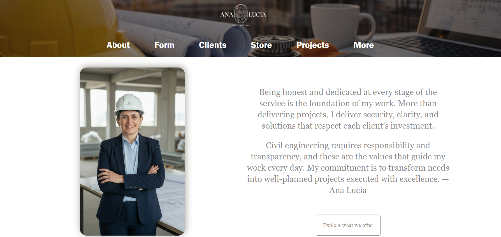
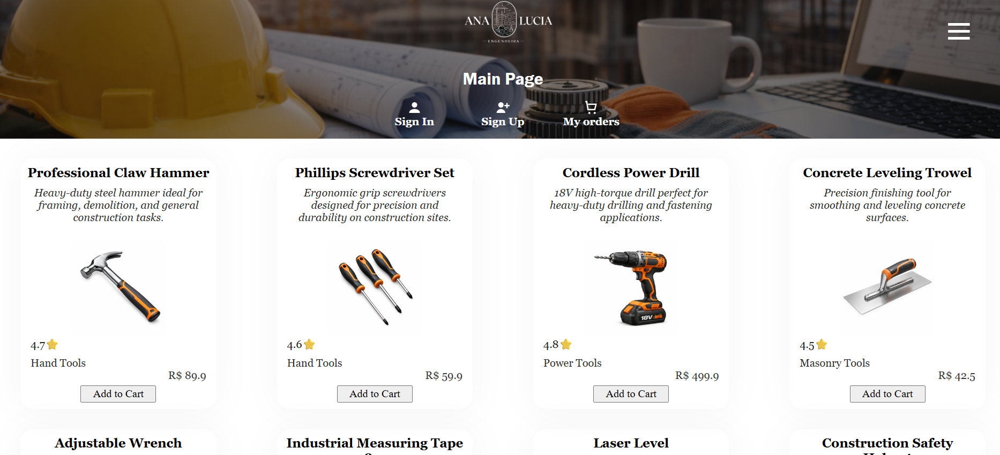
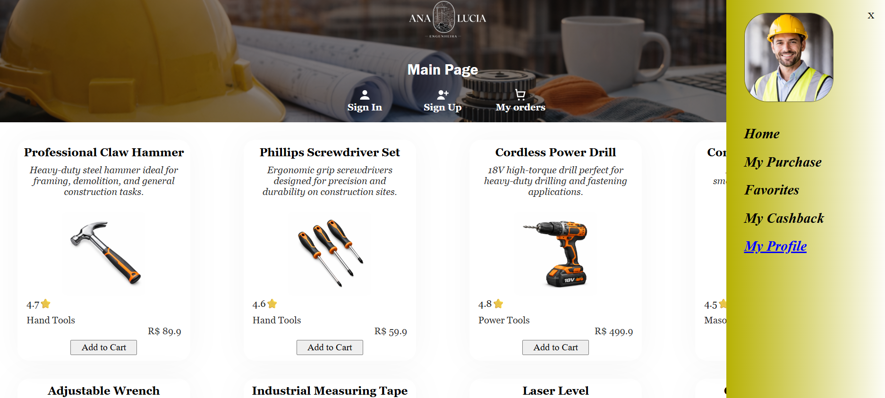

# Ana-Lucia-Engenharia

## Live Demo

https://rodrigomzanetti.github.io/ana_lucia_website/index.html

## Preview

## Project Overview

Ana Lúcia Engenharia is a front-end web project developed to simulate a professional engineering website, with a focus on interactivity, DOM manipulation, and structured JavaScript logic. The website allows user interaction through dynamic elements and scripts, serving as a practice project for combining HTML, CSS, and JavaScript in a real-world–like scenario.

## Features

- Interactive elements handled with JavaScript
- Dynamic behavior controlled via DOM manipulation
- Structured layout using semantic HTML
- Responsive styling with CSS
- Organized assets (images, fonts, vendor files)
- Interactive form validation with JavaScript
- Custom validation feedback using DOM manipulation
- Submit button state control based on form validity

## Technologies Used

• HTML5 – semantic structure and content organization
• CSS3 – layout, responsiveness, and visual styling
• JavaScript (Vanilla JS)

## Project Structure

• index.html – main application markup
• style.css – global styles and responsiveness
• scripts/ – JavaScript files handling interactivity and logic
• blocks/ – reusable layout blocks (CSS architecture)
• images/ – image assets
• vendor/ – third-party or external resources

## How to Run the Project

• Clone or download the repository  
• Open index.html in your browser

Optional (recommended):  
• Run a local server (e.g. VS Code Live Server) to avoid path issues and better simulate a real environment

## Project Status

✅ This project was completed as part of a front-end learning process.
Future improvements may include performance optimization and code modularization.

## Problem-Solving Approach

• Breaking functionality into small, reusable JavaScript functions
• Separating responsibilities between:
• UI state (open/close elements)
• User-triggered events
• DOM updates
• Using defer to ensure scripts load after HTML parsing
• Organizing files to keep logic, styles, and assets clearly separated

Special attention was given to:

• Understanding event flow (click, submit)
• Reading from and writing to the DOM correctly
• Maintaining clean and readable code structure

## What I Learned

During this project I practiced:

• DOM manipulation with JavaScript
• Handling user events such as click and submit
• Implementing client-side form validation
• Structuring front-end projects using organized folders
• Separating logic, layout, and assets for better maintainability

## Author 👤

• GitHub: https://github.com/RodrigoMZanetti
• LinkedIn: https://www.linkedin.com/in/rodrigomaturanozanetti/
